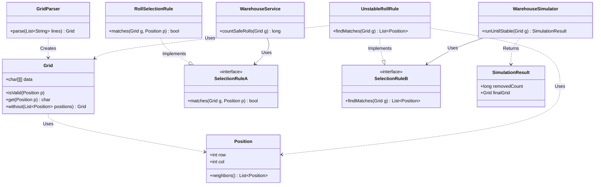

# Advent of Code - Día 04: Seguridad en el Almacén

## 1. Introducción al Diseño

El reto de hoy consiste en identificar rollos de papel en una cuadrícula que cumplan con ciertos criterios de seguridad basados en su entorno. Hemos diseñado una solución que prioriza el **bajo acoplamiento** y la **alta cohesión**, separando la gestión de la cuadrícula de las reglas que dictan qué rollos son seleccionables.

## 2. El Modelo de Dominio

### `Grid.java`

Esta clase actúa como nuestra **abstracción** del espacio físico. Encapsula una matriz de caracteres y proporciona métodos seguros para acceder a la información.

* **Inmutabilidad**: Incluye un constructor privado y un método `without` que permiten crear nuevas versiones de la cuadrícula en lugar de modificar la original, evitando efectos secundarios.
* **Expresividad**: Proporciona un `Stream` de todas las posiciones, facilitando el procesamiento funcional del almacén.

### `GridParser.java`

Se encarga de transformar una lista de strings en un `Grid` inmutable. Esto permite que `Main` y cualquier otro consumidor no se preocupe de cómo se construye internamente el `Grid`.

### `Position.java` (Record)

En lugar de manejar enteros `x` e `y` sueltos por el código, usamos este `record` inmutable. Su método más potente es `neighbors()`, que utiliza un sistema de **deltas** para calcular automáticamente las 8 celdas adyacentes, encapsulando la complejidad matemática de la vecindad.

## 3. Abstracción de Reglas: `SelectionRule`

Para cumplir con el **Principio de Inversión de Dependencias (DIP)**, hemos creado una interfaz funcional. Esto significa que nuestro servicio no sabe *qué* está buscando, solo sabe *cómo preguntar* si una posición es válida.

* **`RollSelectionRule`**: Es nuestra implementación concreta. Aplica la regla de negocio: un símbolo debe ser `@` y debe tener menos de 4 vecinos del mismo tipo. Es una clase enfocada exclusivamente en esta tarea, respetando el **Principio de Responsabilidad Única (SRP)**.

## 4. El Servicio: `WarehouseService`

El servicio funciona como un motor de procesamiento **stateless**.

1. Genera un flujo de todas las coordenadas posibles del almacén.
2. Filtra cada posición utilizando la regla inyectada.
3. Cuenta los resultados. Al recibir la regla por constructor, el servicio está **abierto a la extensión pero cerrado a la modificación (OCP)**.

## 5. Fundamentos de Ingeniería Aplicados

* **Modularidad**: Hemos dividido el sistema en componentes independientes que podrían ser probados por separado (Unit Testing).
* **Código Expresivo**: El uso de Java Streams y nombres de métodos claros (como `isValid` o `matches`) asegura que el código sea fácil de leer y mantener.
* **Evitar Repetición (DRY)**: La lógica de navegación por la matriz está centralizada en `Grid` y `Position`, eliminando la necesidad de escribir bucles anidados `for` en múltiples lugares del programa.

---

## *Este enfoque garantiza que, si las reglas de seguridad del almacén cambian en la Parte B, el núcleo de nuestro sistema permanecerá estable y robusto.*

 Es digno de mención el uso de `.boxed()` en los streams, que sirve pa convertir los objetos primitivos en su decorador/clase envolvente
---
# Parte B: Simulación de Estabilidad

## 1. Introducción: Uno a muchos

Mientras que la Parte A era un recuento estático, la Parte B introduce un comportamiento dinámico: la **reacción en cadena**. Cuando un rollo inestable se elimina, puede provocar que sus vecinos también pierdan estabilidad, requiriendo un proceso iterativo hasta que el sistema se equilibre.

Esta solución se basa en fundamentos de **alta cohesión** y **bajo acoplamiento**, reutilizando la infraestructura de coordenadas del reto anterior y el **GridParser** para centrarse puramente en la lógica de simulación.

El Grid Final lo imprimo por 2 motivos:
* *1. Estaba teniendo problemas y quería visualizar*
* *2. Se ve increíble*

## 2. El Motor de Simulación: `WarehouseSimulator`

El simulador actúa como un motor de ejecución que no conoce las reglas específicas de eliminación, solo conoce el proceso de iteración.

* **Bucle de Estabilidad**: Ejecuta un ciclo `while` que solo se detiene cuando la regla de selección no devuelve más elementos para eliminar.
* **Transición de Estado Inmutable**: En cada paso, se genera una versión nueva del almacén (`currentGrid.without()`). Esto garantiza que los cambios de una iteración no interfieran con el análisis de la misma, manteniendo la integridad de los datos.

## 3. Nueva Abstracción de Reglas: `SelectionRule`

Hemos evolucionado la interfaz anterior para manejar conjuntos de datos en lugar de posiciones individuales:

* **`findMatches`**: A diferencia de la Parte A (que validaba una posición), esta nueva interfaz analiza el almacén completo y devuelve una lista de todas las posiciones que incumplen la norma.
* **`UnstableRollRule`**: Implementa el criterio de inestabilidad. Si un rollo tiene menos de 4 vecinos, se marca para su eliminación. Al estar separada del simulador, podríamos cambiar la regla por una de "incendio" o "caducidad" sin tocar el motor de simulación.

## 4. Reutilización y Extensibilidad

**Open/Closed** (OCP):

* **Reutilización de A**: Importamos `Grid` y `Position` del paquete original. No hemos tenido que volver a escribir la compleja lógica de cálculo de vecinos o límites de la matriz.
* **Acoplamiento Débil**: El `Main` utiliza **GridParser** para construir el grid inicial, conectando todas las piezas sin duplicar lógica de parsing y siguiendo el patrón de diseño de **Inversión de Dependencias**.

## 5. Resultados y Salida de Datos

La simulación concluye devolviendo un `SimulationResult`. Este objeto contiene:

1. El número total de rollos que fueron retirados durante todo el proceso.
2. El estado final del almacén para su visualización. Este diseño permite que el `Main` sea extremadamente limpio y expresivo, delegando toda la complejidad técnica a los componentes especializados.

---

*Al tratar las reglas de negocio como piezas intercambiables, usando un grid inmutable y centralizando el parsing con `GridParser`, hemos creado un simulador robusto capaz de manejar cualquier lógica de evolución de celdas.*
