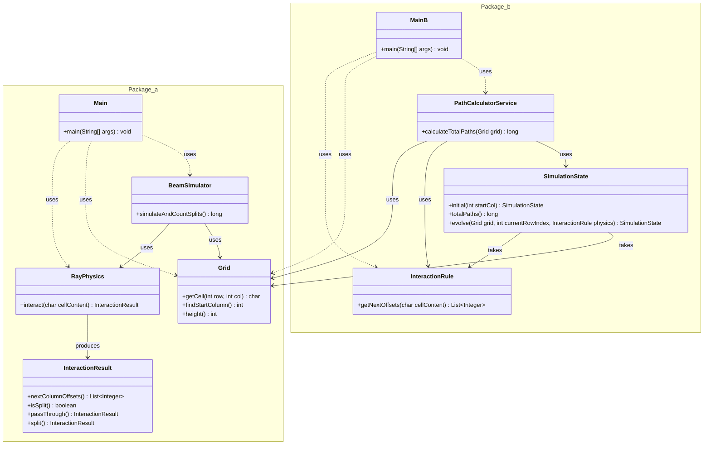

# Advent of Code - Día 07: Simulación de Rayos y Gravedad

## 1. Introducción al Diseño
El reto de hoy consiste en seguir la trayectoria de un rayo que cae a través de un mapa, pudiendo dividirse al impactar con ciertos elementos (`^`). Hemos aplicado un diseño de **Alta Cohesión** donde la simulación no conoce las reglas físicas, sino que las consulta a un motor especializado.

---

---

## 2. El Escenario: `Grid`
La clase `Grid` actúa como el fundamento del sistema, gestionando el mapa de forma inmutable.

- **Búsqueda Dinámica**: Localiza automáticamente el punto de origen `S` sin necesidad de coordenadas fijas en el código.
---

## 3. El Motor de Física: `RayPhysics`
Siguiendo el **Principio de Responsabilidad Única (SRP)**, la lógica de colisión está aislada de la lógica de movimiento.

- **`InteractionResult`**: Es un **Value Object** (Record) que comunica si el rayo debe dividirse y hacia qué columnas debe propagarse.
- **Abstracción de Interacción**: Al separar esta lógica, el sistema cumple con el **Principio Abierto/Cerrado (OCP)**; añadir espejos o bloqueos es tan sencillo como actualizar este componente sin tocar el simulador.

---

## 4. El Simulador de Rayos
`BeamSimulator` realiza una propagación por niveles (fila a fila), similar a un recorrido en anchura.

- **Evolución de Estado**: Utiliza un conjunto de `activeColumns` que se reemplaza en cada fila, evitando efectos secundarios y manteniendo la **Inmutabilidad** del proceso.
- **Detección de Divisiones**: Lleva el recuento de "splits" basándose exclusivamente en lo que dicta la física, actuando como un orquestador puro.
- **Optimización de Salida**: Si en una fila no quedan rayos activos (se salieron del mapa o se bloquearon), el simulador termina la ejecución inmediatamente.

---

## 5. Fundamentos de Software Aplicados
- **Inversión de Dependencias (DIP)**: El simulador depende de una lógica de física inyectada, facilitando el intercambio de reglas.
- **Bajo Acoplamiento**: Los componentes se comunican mediante contratos simples (`InteractionResult`), lo que permite escalar el sistema con nuevos tipos de obstáculos sin riesgo de regresiones.
- **Código Expresivo**: El uso de métodos estáticos como `InteractionResult.split()` mejora la legibilidad, haciendo que el código se explique a sí mismo.

---

*Este enfoque transforma un problema de trayectorias en una simulación física modular, preparada para cualquier tipo de obstáculo que el reto pueda presentar en el futuro.*

---

# Parte B: Cálculo de Caminos y Convergencia

## 1. Introducción: De Partículas a Probabilidades
En esta segunda fase, el reto no es solo seguir la trayectoria, sino calcular cuántos caminos diferentes pueden alcanzar la base del mapa. Esto transforma el problema en uno de **programación dinámica** fila a fila. En lugar de simular rayos individuales, simulamos un "frente de onda" que se acumula cuando múltiples trayectorias convergen en la misma posición.

---

## 2. Gestión de Estado Inmutable: `SimulationState`
Siguiendo los fundamentos de **Inmutabilidad** y **Alta Cohesión**, hemos creado una clase dedicada a gestionar el estado actual de la simulación.

- **Encapsulamiento de Datos**: Utiliza un mapa interno donde la clave es la columna y el valor es la cantidad de caminos (`Long`) que llegan a ella.
- **Copia Defensiva**: El constructor utiliza `Map.copyOf` para asegurar que el estado de una fila sea inmutable y no pueda ser alterado por agentes externos.
- **Lógica de Fusión**: El método `evolve` utiliza `Map.merge` con una función de suma. Este es el corazón del sistema: si dos caminos de diferentes columnas convergen en una misma celda inferior, sus intensidades se suman.

---

## 3. Topología de Movimiento: `InteractionRule`
Para mantener el **Bajo Acoplamiento**, hemos separado la aritmética de los caminos de la geometría del movimiento.

- **Offsets de Dirección**: Esta clase solo se preocupa de dictar hacia dónde se mueve el flujo. Ante un divisor (`^`), devuelve una lista con los desplazamientos `[-1, 1]`.
- **Simplificación**: Al devolver una lista de desplazamientos, permite que el simulador trate de forma uniforme tanto los pasos directos como las divisiones, eliminando la necesidad de sentencias `if` complejas en el motor principal (Principio de Responsabilidad Única).

---

## 4. Orquestación: `PathCalculatorService`
El servicio de cálculo actúa como el director de orquesta que hace evolucionar el sistema.

- **Inyección de Dependencias (DIP)**: Recibe las reglas físicas por constructor, permitiendo que el cálculo sea agnóstico a si el rayo se divide, rebota o se bloquea.
- **Bucle de Evolución**: Itera a través de la altura del `Grid`, actualizando el `SimulationState` en cada paso. Si en algún punto el estado se queda vacío (todos los caminos se salieron del mapa), el servicio detiene la ejecución prematuramente (short-circuit).

---

## 5. Fundamentos SOLID Aplicados
- **Principio Abierto/Cerrado (OCP)**: Si el reto introdujera un “agujero negro” que absorbe caminos, solo tendríamos que crear una regla que devuelva una lista vacía de offsets; el resto del código permanecería intacto.
- **Código Expresivo**: El uso de un **Factory Method** como `SimulationState.initial()` hace que el punto de partida de la simulación sea explícito y fácil de entender.
- **Modularidad**: Cada componente tiene una frontera clara. El `Grid` maneja el espacio físico, la `InteractionRule` maneja la física y el `SimulationState` maneja la matemática de los caminos.
- **DRY**: Usamos de nuevo la clase `Grid` del paquete a.
---

*Este diseño permite procesar millones de caminos potenciales de forma eficiente, utilizando la convergencia para evitar el crecimiento exponencial del cálculo.*
