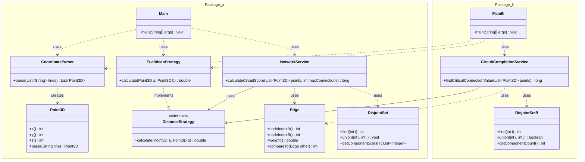

# Advent of Code - Día 08: Análisis de Circuitos y Conectividad

Este proyecto implementa una solución modular para el procesamiento de coordenadas y análisis de grafos en 3D. El diseño sigue principios de ingeniería de software robustos para garantizar la mantenibilidad y la extensibilidad.

---

## Class Diagram

---

# Parte A: Agrupación y Puntuación de Circuitos

## 1. Introducción al Diseño
El objetivo de la Parte A es parsear coordenadas, construir un grafo basado en distancias y calcular una métrica basada en el tamaño de los componentes conectados. El diseño favorece la **Modularidad**, dividiendo el sistema en componentes independientes para facilitar su gestión.

## 2. Componentes y Patrones

### `Point3D` (Modelo)
Clase inmutable (Java Record) que representa un punto en el espacio.
- **Patrón Factory Method**: Utilizamos el método estático `parse(String line)` en lugar de exponer la lógica de conversión en el constructor. Esto se alinea con el patrón **Factory Method**, donde se utiliza un método estático para encapsular la creación del objeto.
- **Alta Cohesión**: La clase se enfoca exclusivamente en almacenar datos y su propia representación, cumpliendo con la idea de que las partes de un módulo deben estar estrechamente relacionadas.

### `CoordinateParser` (Infraestructura)
- **Principio de Responsabilidad Única (SRP)**: Esta clase tiene una sola razón para cambiar: si el formato del archivo de entrada cambia. Separa la lógica de lectura (IO) de la lógica de negocio.

### `DistanceStrategy` (Abstracción)
Interfaz funcional que define cómo se calcula la distancia entre dos puntos.
- **Principio de Inversión de Dependencias (DIP)**: Los servicios de alto nivel (`NetworkService`) no dependen de módulos de bajo nivel (`EuclideanStrategy`), sino de esta abstracción (`DistanceStrategy`).
- **Principio Abierto/Cerrado (OCP)**: El sistema está abierto a la extensión (podemos añadir una estrategia de distancia Manhattan) pero cerrado a la modificación del código existente que usa la estrategia.

### `NetworkService` (Lógica de Negocio)
Orquesta la creación de aristas (`Edge`) y la unión de componentes.
- **Bajo Acoplamiento**: Al depender de la interfaz `DistanceStrategy`, el servicio tiene pocas interdependencias con la implementación matemática concreta.
- **Uso de `DisjointSet`**: Delega la complejidad de la gestión de grafos a una clase especializada, mejorando la legibilidad.

### `DisjointSet` (Manejo de sets de nodos) ###
Es el objeto en el que se convierten los nodos al unirse

---

# Parte B: Conectividad Global (Kruskal)

## 1. Evolución del Diseño
En la Parte B, el problema cambia para encontrar la "arista crítica" que unifica todo el sistema. Gracias a la **Modularidad**, gran parte del código de la Parte A se reutiliza sin cambios.

## 2. Componentes Clave

### `DisjointSet` (Estructura de Datos)
Se ha adaptado para monitorear el estado global de la red.
- **Encapsulamiento de Estado**: Mantiene un contador interno `componentCount`. Esto permite saber si el grafo está totalmente conectado sin exponer la representación subyacente de los arrays `parent` y `size`.
- **Código Expresivo**: Métodos como `union` y `find` hacen que el algoritmo sea claro y comprensible, facilitando el mantenimiento.

### `CircuitCompletionService` (Lógica de Negocio)
Implementa una variación del algoritmo de Kruskal.
- **Principio de No Repetir Código (DRY)**: Reutiliza la lógica de generación de aristas y la estructura de datos definida anteriormente. Cada pieza de conocimiento (como el cálculo de distancias) tiene una representación única.
- **Principio de Sustitución de Liskov (LSP)**: Las instancias de `Point3D` y `Edge` se comportan de manera consistente en ambos servicios, asegurando que los módulos sean intercambiables y el sistema predecible.

### `Main` (Punto de Entrada)
- **Inyección de Dependencias**: El `Main` es responsable de ensamblar las piezas. Crea la instancia concreta de `EuclideanStrategy` y la pasa al constructor del servicio. Esto refuerza el desacoplamiento y facilita las pruebas unitarias.

---

## Resumen de Conceptos Aplicados

| Concepto | Implementación en Código | Descripción |
| :--- | :--- | :--- |
| **Factory Method** | `Point3D.parse()` | Método estático que encapsula la creación de instancias complejas. |
| **SRP** | `CoordinateParser` vs `NetworkService` | Separación clara entre Parsing (IO) y Lógica de Negocio. |
| **OCP** | `DistanceStrategy` | Permite nuevas fórmulas matemáticas sin editar los servicios. |
| **DIP** | `NetworkService(DistanceStrategy)` | Dependencia de interfaces y no de clases concretas. |
| **Alta Cohesión** | `DisjointSet` | Maneja solo lógica de estructuras de datos, nada de negocio. |