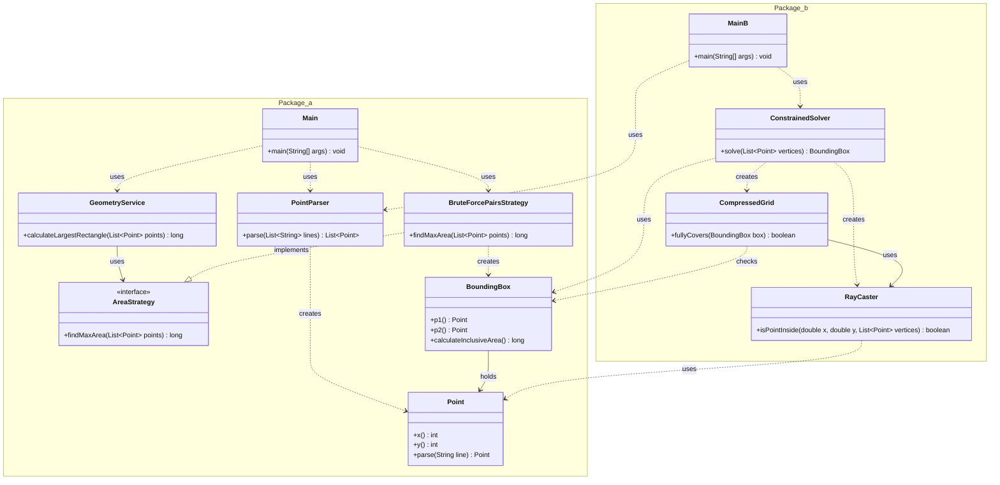

# Advent of Code - Día 09: Geometría Computacional y Optimización Espacial

Este proyecto implementa soluciones para problemas geométricos, aplicando principios de diseño que garantizan la flexibilidad del algoritmo y la eficiencia en el manejo de coordenadas.

---

## Class Diagram

---

# Parte A: Cálculo de Áreas y Estrategias Flexibles

## 1. Introducción al Diseño
El objetivo de la primera parte es encontrar el rectángulo de mayor área posible a partir de una nube de puntos. El diseño prioriza el **Bajo Acoplamiento** y la **Abstracción**, permitiendo que la lógica de selección del algoritmo sea independiente del flujo principal del programa.

## 2. Componentes y Principios Aplicados

### `Point` (Modelo y Creación)
Implementado como un `record` para asegurar la inmutabilidad de los datos.
- **Patrón Factory Method**: Utilizamos el método estático `parse(String line)` en lugar de un constructor complejo. Este método estático encapsula la lógica de creación del objeto, un enfoque alineado con la definición del patrón Factory Method donde se utiliza un método estático para crear instancias.

### `PointParser` (Procesamiento Declarativo)
Encargado de transformar la entrada de texto en objetos `Point`.
- **Enfoque Funcional**: Utiliza la API de `Stream` de Java para procesar las líneas de manera declarativa, eliminando bucles explícitos.
- **Delegación**: Delega el parseo de cada línea al método estático `Point::parse`.

### `GeometryService` y `AreaStrategy` (Inversión de Dependencias)
El servicio de geometría no implementa el algoritmo de búsqueda directamente.
- **Principio de Inversión de Dependencias (DIP)**: `GeometryService` depende de la abstracción `AreaStrategy`, no de la clase concreta `BruteForcePairsStrategy`. Esto cumple con el principio de que los módulos de alto nivel no deben depender de módulos de bajo nivel, sino de abstracciones.
- **Principio Abierto/Cerrado (OCP)**: El diseño permite la extensión (nuevas estrategias de cálculo) sin modificar el código del servicio, manteniendo las clases cerradas para modificación pero abiertas para extensión.

### `BoundingBox` (Alta Cohesión)
- **Alta Cohesión**: Esta clase agrupa los datos (puntos p1, p2) y la lógica relacionada (cálculo de área) en una única entidad. Esto refleja la idea de que las partes de un módulo deben estar estrechamente relacionadas y enfocadas en una tarea.

---

# Parte B: Restricciones Espaciales y Compresión

## 1. Evolución del Problema
En la Parte B, se introduce una restricción compleja: el rectángulo debe estar contenido dentro de un polígono arbitrario. Esto requiere algoritmos más sofisticados (`RayCaster`) y estructuras optimizadas (`CompressedGrid`).

## 2. Arquitectura y Reutilización

### `RayCaster` (Responsabilidad Única)
Esta clase implementa el algoritmo **Ray Casting** (regla Even-Odd) para determinar geométricamente la inclusión de puntos.
- **Principio de Responsabilidad Única (SRP)**: Su única responsabilidad es resolver consultas geométricas (intersecciones), manteniéndose aislada de la lógica de optimización de la grilla.

### `CompressedGrid` (Optimización)
Implementa **Compresión de Coordenadas** para reducir un espacio continuo masivo a una matriz lógica discreta y manejable.
- **Pre-cálculo Eficiente**: Mapea coordenadas del mundo real a índices de matriz y pre-calcula la validez ("solidez") de cada celda usando `RayCaster` durante la construcción.
- **Búsqueda Binaria**: Utiliza búsquedas binarias para verificar regiones completas en tiempo constante o logarítmico, evitando iteraciones costosas.

### `Main` y Reutilización
- **Principio de No Repetir Código (DRY)**: El sistema reutiliza componentes de la Parte A como `PointParser`, `Point` y `BoundingBox`. Esto se alinea con el principio de que cada pieza de conocimiento debe tener una representación única e inequívoca en el sistema.

### `ConstrainedSolver` (Programación Funcional)
Servicio que orquesta la resolución utilizando flujos paralelos (`parallel stream`).
- **Pipeline Paralelo**: Genera candidatos y los filtra concurrentemente. Trivialmente seguro gracias a la inmutabilidad de los modelos (`Point`, `BoundingBox`).

---

## Resumen de Fundamentos

| Concepto | Implementación | Referencia Teórica |
| :--- | :--- | :--- |
| **Factory Method** | `Point.parse` | Encapsula la creación de objetos. |
| **DIP** | `GeometryService` -> `AreaStrategy` | Dependencia de abstracciones. |
| **SRP** | `RayCaster` | Separación de lógica matemática compleja. |
| **OCP** | Estrategias intercambiables | Abierto a extensión, cerrado a modificación. |
| **Alta Cohesión** | `BoundingBox` | Datos y comportamiento juntos. |