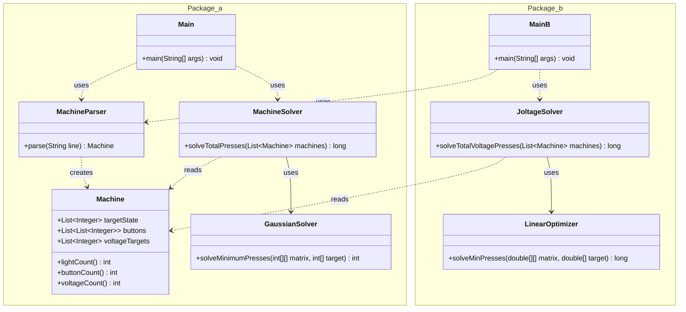

# Advent of Code - Día 10: Sistemas de Ecuaciones en la Maquinaria

Este proyecto aborda la resolución de sistemas de ecuaciones lineales desde dos perspectivas matemáticas distintas (Cuerpos Finitos y Optimización Entera), manteniendo una arquitectura limpia y modular. Como el cálculo de las soluciones es complejo y largo, aquí me centaré más en la función general, estructura y principios aplicados.

---

## Class Diagram

---

## Estructura y Función de Archivos

### 1. Núcleo Común (Modelado e Infraestructura)

#### `Machine.java` (Modelo)
*   **Función**: Representa el estado inmutable de una máquina (luces, botones, objetivos de voltaje).
*   **Estructura**: Implementado como un Java `record`.
*   **Principios**:
    *   **Inmutabilidad**: Facilita el paso de datos entre capas y la ejecución segura en paralelo.
    *   **Data Carrier**: Actúa puramente como contenedor de datos sin lógica de negocio compleja.

#### `MachineParser.java` (Entrada)
*   **Función**: Interpreta las líneas de texto crudo y construye objetos `Machine`.
*   **Estructura**: Utiliza Expresiones Regulares (`Pattern`, `Matcher`) para extraer configuraciones complejas.
*   **Principios**:
    *   **Single Responsibility Principle (SRP)**: Aísla la lógica de *parsing* del resto del sistema. Si el formato de entrada cambia, solo esta clase debe modificarse.

---

### 2. Parte A: Sistemas Binarios (GF(2))

En esta fase, los botones actúan como interruptores (XOR), modelados como un sistema sobre el cuerpo finito de 2 elementos.

#### `MachineSolver.java` (Orquestador A)
*   **Función**: Transforma el objeto de dominio `Machine` en una matriz de adyacencia binaria y delega la resolución matemática.
*   **Estructura**: Construye la matriz $Ax=b$ donde las filas son luces y las columnas son botones.

#### `GaussianSolver.java` (Motor Matemático A)
*   **Función**: Resuelve sistemas de ecuaciones lineales sobre GF(2) minimizando el número de botones pulsados.
*   **Estructura**:
    *   **Eliminación Gaussiana**: Convierte la matriz a su forma escalonada usando operaciones XOR.
    *   **Minimización de Hamming**: Explora las variables libres para encontrar la solución con menor "peso" (mínimo número de 1s).
*   **Principios**:
    *   **Alta Cohesión**: Encapsula exclusivamente algoritmos de álgebra lineal sobre cuerpos finitos.

---

### 3. Parte B: Optimización Entera

En esta fase, el comportamiento cambia a acumulativo (suma de enteros), requiriendo un enfoque algebraico diferente.

#### `JoltageSolver.java` (Orquestador B)
*   **Función**: Adapta el problema de voltajes a un sistema de ecuaciones lineales reales.
*   **Estructura**: Mapea los incrementos de voltaje a una matriz de coeficientes `duble[][]`.

#### `LinearOptimizer.java` (Motor Matemático B)
*   **Función**: Encuentra soluciones enteras no negativas para sistemas determinados o indeterminados.
*   **Estructura**:
    *   **Gauss-Jordan (RREF)**: Reduce el sistema utilizando aritmética de punto flotante con precisión controlada (`EPSILON`).
    *   **Búsqueda Acotada**: Utiliza un **Límite Dinámico** basado en el voltaje objetivo máximo para podar el espacio de búsqueda de las variables libres, garantizando terminación eficiente.
*   **Principios**:
    *   **Open/Closed (OCP)**: Permite introducir un nuevo motor de resolución complejo sin tocar la lógica de parsing o el modelo original.

---

## Principios de Ingeniería Aplicados

| Principio | Aplicación en el Código |
| :--- | :--- |
| **SRP (Responsabilidad Única)** | `MachineParser` solo parsea. `GaussianSolver` solo hace matemáticas binarias. `LinearOptimizer` solo optimiza enteros. |
| **OCP (Abierto/Cerrado)** | El sistema escaló de la Parte A a la B añadiendo nuevas clases solvers (`JoltageSolver`, `LinearOptimizer`) sin modificar el modelo `Machine` ni romper la lógica existente. |
| **Inmutabilidad** | El uso de `record` para `Machine` previene efectos secundarios indeseados y simplifica el razonamiento sobre el estado. |
| **Separación de Intereses** | La lógica de "Negocio" (Botones, Luces) está separada de la lógica "Matemática" (Matrices, Vectores, Pivotaje). |
