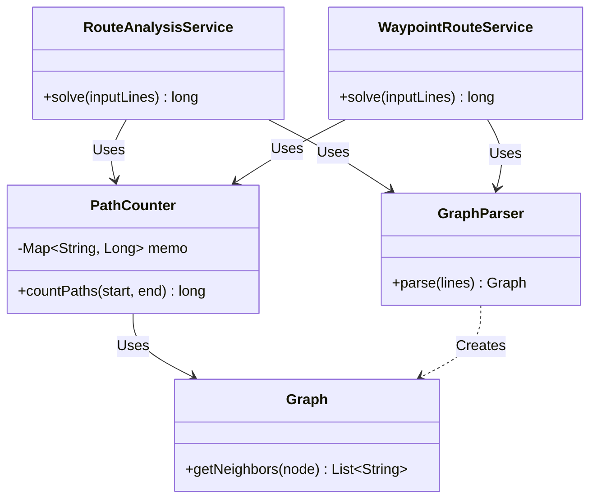

# Advent of Code - Día 11: Navegación de Grafos y Memoización

## Mapa de la Solución (UML)

## Algoritmo Principal
El núcleo de la solución se basa en una **Búsqueda en Profundidad (DFS) con Memoización**. Este enfoque permite explorar exhaustivamente las rutas posibles evitando la explosión combinatoria mediante el almacenamiento en caché de los resultados de sub-rutas ya calculadas.

---

## Parte A: Conteo de Rutas en Grafos Dirigidos

### 1. Orquestación: `RouteAnalysisService`
La clase `RouteAnalysisService` actúa como el punto de entrada principal para el problema de la Parte A. Su responsabilidad es coordinar el flujo de ejecución:
- **Parsing**: Invoca a `GraphParser` para convertir la entrada textual en una estructura de grafo manejable.
- **Ejecución**: Instancia el `PathCounter` con el grafo construido.
- **Resolución**: Llama al método de conteo especificando los nodos de inicio ("you") y fin ("out") definidos por el problema.

### 2. El Modelo de Grafo
La estructura del problema se basa en un **grafo dirigido**, donde cada nodo representa una ubicación y las aristas definen las rutas posibles entre ellas.

- **`Graph`**: Utiliza una lista de adyacencia **inmutable** para representar las interdependencias con bajo acoplamiento y alta seguridad frente a efectos secundarios.
- **`GraphParser`**: Emplea *Java Streams* para procesar el formato de texto de entrada y construir eficientemente el mapa de conexiones.

### 3. Algoritmo de Conteo: `PathCounter`
Calcular todos los caminos posibles en un grafo dirigido puede ser costoso. Para optimizarlo, `PathCounter` implementa la lógica de DFS con memoización:

- **Caso Base**: Cuando el nodo actual coincide con el destino, retorna `1`.
- **Memoización**: Utiliza un `Map<String, Long>` para cachear resultados. Si el conteo desde un nodo ya existe, se retorna inmediatamente.
- **Recursividad**: Suma los caminos válidos desde todos los vecinos del nodo actual.

---

## Parte B: Rutas Complejas con Puntos de Paso

### 1. Lógica Avanzada: `WaypointRouteService`
Para la segunda parte, la clase `WaypointRouteService` extiende la lógica de resolución para manejar restricciones adicionales: pasar obligatoriamente por puntos de paso específicos (`fft` y `dac`).

Esta clase demuestra la modularidad del sistema al **no duplicar lógica de conteo**, sino componer soluciones más complejas reutilizando las herramientas existentes.

### 2. Composición de Caminos
El problema se descompone en tramos independientes que se calculan secuencialmente usando `PathCounter`:
- **Segmentación**: Calcula rutas parciales (Inicio → A, A → B, B → Fin).
- **Multiplicación**: El total de rutas para una variante es el producto de las rutas de sus tramos.
- **Suma de Variantes**: Considera las dos permutaciones posibles de visita a los puntos de paso y suma sus resultados.

---

## Fundamentos y Principios Aplicados

- **Dependency Inversion Principle (DIP)**  
  Los servicios de alto nivel dependen de abstracciones y componentes reutilizables (`PathCounter`, `Graph`), desacoplando la lógica de orquestación de la implementación del grafo.

- **Single Responsibility Principle (SRP)**  
  - `RouteAnalysisService` y `WaypointRouteService`: Coordinan la lógica de negocio específica de cada parte.
  - `PathCounter`: Se encarga exclusivamente del algoritmo matemático de conteo.
  - `GraphParser`: Maneja solo la interpretación de datos.

- **Inmutabilidad**  
  El uso de `Map.copyOf` en `Graph` y el paso de estructuras inmutables garantizan la integridad de los datos durante la recursión profunda.

---

## Conclusión
Este enfoque transforma un problema clásico de búsqueda en grafos en una solución de **alto rendimiento**, combinando DFS con memoización y un diseño modular que permite resolver variantes complejas del problema (como la introducción de Waypoints) mediante la simple composición de primitivas ya testeadas.
