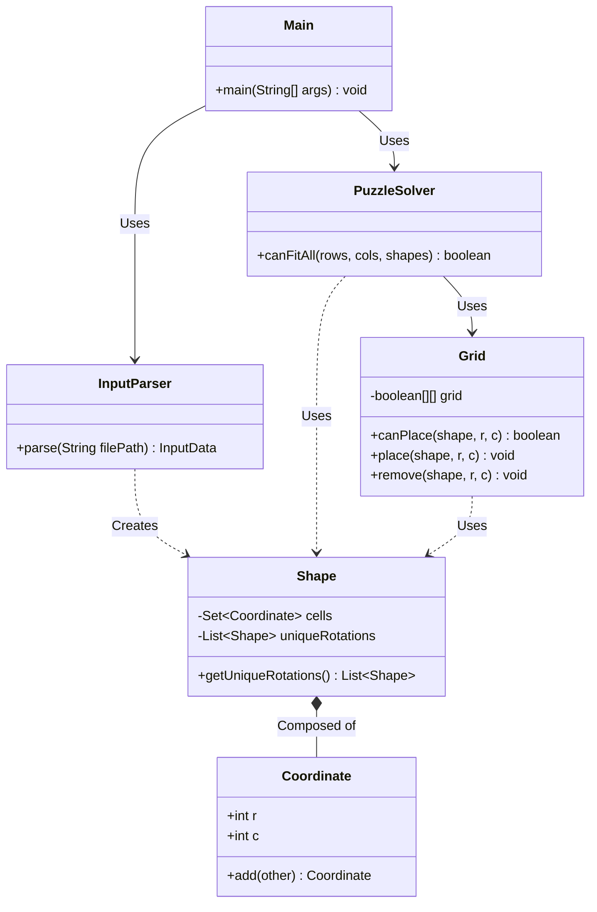

# Advent of Code - Día 12: Empaquetamiento de Regalos (2D Packing)

## 1. Introducción al Problema
El reto final nos plantea un problema de optimización combinatoria: ¿podemos encajar un conjunto de figuras irregulares en una rejilla de dimensiones fijas? A diferencia de retos anteriores, aquí el estado es altamente volátil y el árbol de decisiones es enorme, lo que nos obliga a usar técnicas de **Backtracking** asistidas por geometría computacional.

## Class Diagram

## 2. El Modelo Geométrico: `Shape`, `Grid` y `Coordinate`
Para manejar la complejidad de las figuras, hemos aplicado principios de **Alta Cohesión**:

- **Gestión de Rotaciones**: La clase pre-calcula las rotaciones únicas de cada figura. Mediante el uso de `distinct()`, evitamos probar posiciones redundantes para figuras simétricas (como un cuadrado o una línea).
- **Abstracción del Tablero**: El `Grid` gestiona la ocupación de celdas mediante una matriz de booleanos, proporcionando métodos seguros para `place`, `remove` y el chequeo de colisiones `canPlace`.
- **Coordenadas Inmutables**: El uso de `Coordinate` como un `record` simplifica las operaciones aritméticas de posición (suma de vectores) y garantiza que la ubicación relativa de las celdas de una figura no se corrompa durante las manipulaciones. Además, su implementación automática de `equals` y `hashCode` es crítica para que las colecciones `Set<Coordinate>` en `Shape` filtren duplicados geométricos correctamente.

## 3. Motor de Resolución: Backtracking Optimizado
El `PuzzleSolver` implementa una búsqueda recursiva profunda. Para que este proceso sea viable en tiempos razonables, aplicamos varias estrategias:
1. **Poda por Área**: Antes de empezar, sumamos el área de todas las figuras. Si el total supera el área del contenedor, descartamos el caso inmediatamente.
2. **Ordenación Crítica**: Ordenamos las figuras de mayor a menor tamaño. Es un fundamento de diseño: encajar las piezas grandes al principio reduce drásticamente las ramas fallidas del árbol de búsqueda.
3. **Recursión con Deshacer**: El algoritmo intenta colocar una figura, avanza a la siguiente y, si llega a un callejón sin salida, "deshace" el movimiento (Backtrack) para probar una nueva posición o rotación.

## 4. El Analizador: `InputParser`
Debido a que el archivo de entrada (`Presents.txt`) mezcla definiciones visuales de figuras con casos de prueba compactos, el `InputParser` utiliza un enfoque de **análisis por estados**:
- **Sección de Figuras**: Lee bloques de caracteres `#` y los convierte en conjuntos de coordenadas.
- **Sección de Casos**: Utiliza Expresiones Regulares (Regex) para interpretar líneas tipo `12x5: 1 0 1`, traduciendo los IDs de figura a listas de objetos reales listos para ser procesados.

## 5. Fundamentos de Software y SOLID Aplicados
- **Responsabilidad Única (SRP)**: El `Grid` solo sabe de colisiones, el `Shape` solo de geometría y el `Solver` solo de estrategia de búsqueda.
- **Inmutabilidad**: Las figuras y coordenadas son inmutables, lo que garantiza que la rotación de una pieza no altere accidentalmente la definición original.
- **Código Expresivo**: El uso de Streams de Java para calcular áreas y normalizar coordenadas permite que la lógica sea declarativa y fácil de seguir.

